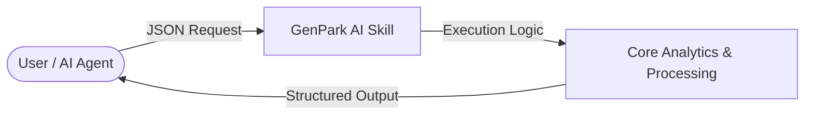

   

# genpark-ad-copy-generator-skill

> **GenPark AI Agent Skill** -- Generate A/B tested ad copy for Google Search, Google Shopping, Meta, and TikTok with character limit compliance.

## Features

- Google Search: headline (30 chars) + description (90 chars)
- Google Shopping: title (150 chars) + description
- Meta (Facebook/Instagram): primary text, headline, description, CTA
- TikTok: ad text + CTA
- Quality scoring based on power words, numbers, and CTA presence
- Full character limit compliance checking
- 3 variants per platform for A/B testing

## Quick Start

```python
from client import AdCopyClient

client = AdCopyClient()
result = client.generate(
    product_name="My Product",
    key_benefits=["saves time", "affordable", "proven results"],
    discount_offer="20% off",
    platform="google_search",
)
for v in result["ads"]["google_search"]:
    print(v["copy"]["headline"], "--", v["quality_score"])
```

## Installation

```bash
python example_usage.py  # No external dependencies
```

---
Built by [GenPark](https://genpark.ai) | [alphaparkinc](https://github.com/alphaparkinc)

## 📊 Agentic Architecture Flowchart


## 🔌 MCP (Model Context Protocol) Integration
Run natively as an MCP server for Cursor, Claude Desktop & LLM frameworks:
```bash
python mcp_server.py
```
